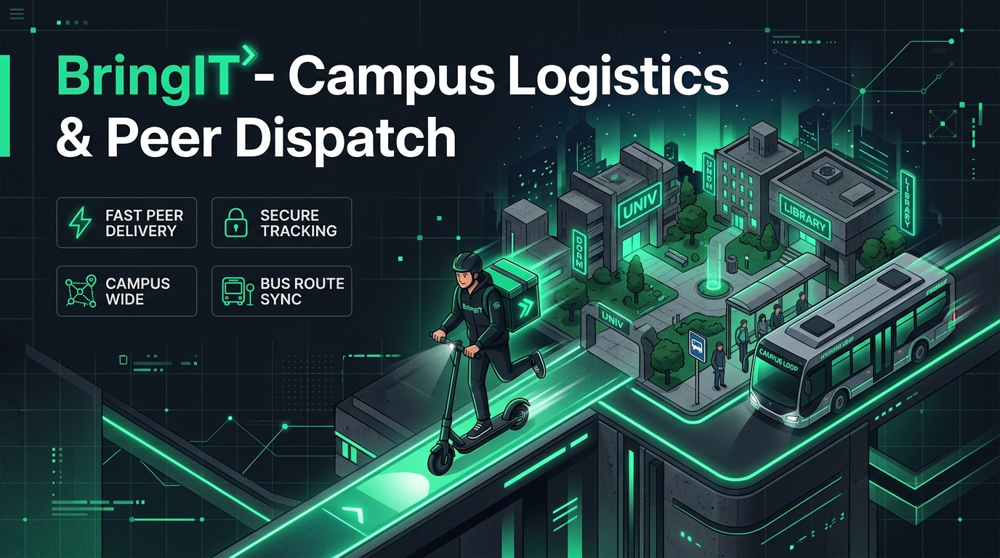
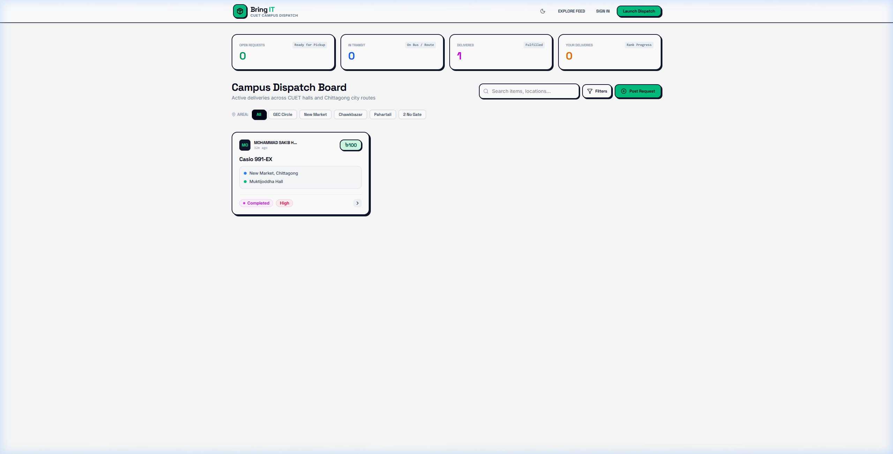
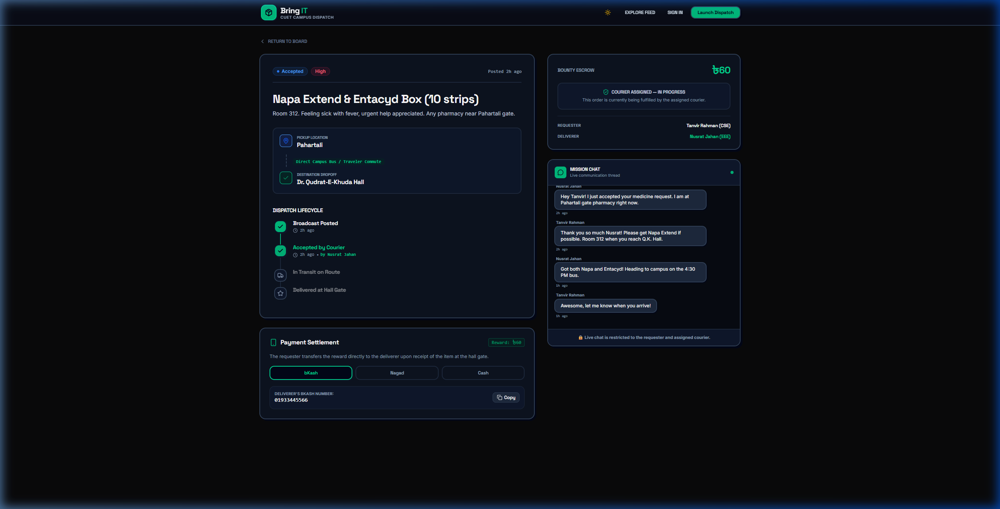
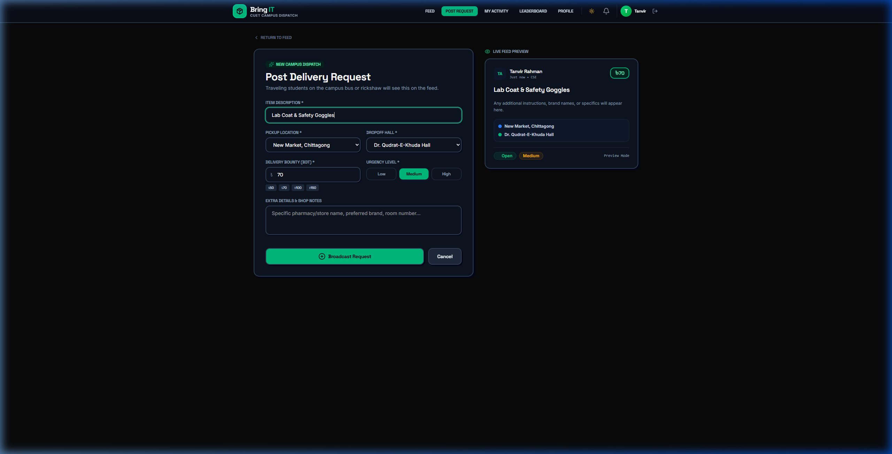
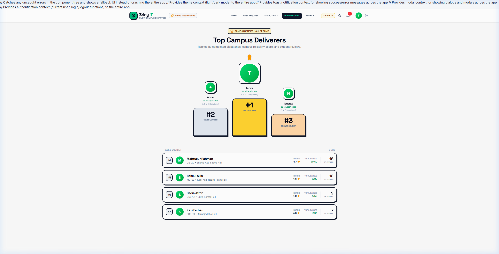

<div align="center">



# 📦 BringIT — Campus Delivery & Peer Dispatch System

**A decentralized, peer-to-peer courier network connecting CUET students on campus buses, rickshaws, and residential halls.**

[](https://bring-it-delivery.netlify.app)
[](https://bring-it-delivery-system.vercel.app)
[](https://react.dev/)
[](https://tailwindcss.com/)
[](https://supabase.com/)
[](LICENSE)

<br />

[Explore Live Demo](https://bring-it-delivery.netlify.app) • [View Video Walkthrough](#-visual-walkthrough) • [Security & RBAC](#-security--access-control) • [Setup Guide](#-getting-started)

</div>

---

## 🌟 Overview

**BringIT** solves a ubiquitous challenge for university campuses located outside city centers: getting urgent essentials, calculators, medicines, drafting tools, and food delivered between distant urban hubs and student dorms.

Instead of waiting for commercial couriers, BringIT leverages the daily movement of commuting students riding university buses or local transit. Students post errand requests with cash bounties, and fellow commuters traveling along those routes accept the missions, coordinate in real time, and deliver directly to dorm gates.

---

## ✨ Core Features

| Feature | Description |
| :--- | :--- |
| 📡 **Live Campus Dispatch Feed** | Real-time board categorized by major campus transit hubs (*GEC Circle, New Market, Chawkbazar, Pahartali, 2 No Gate*). |
| ⚡ **Live Reactive Form Preview** | Interactive errand submission form that renders a real-time reactive card preview as the user types. |
| 🗺️ **Mission Control & Stepper** | 4-step progress tracker (*Broadcast Posted ➔ Accepted by Courier ➔ In Transit ➔ Delivered*) with timestamp history. |
| 💬 **Private Mission Chat** | In-app WebSocket communication channel between the requester and courier with 1-click quick-reply chips. |
| 💳 **Bounty & Mobile Escrow** | Transparent settlement supporting **bKash**, **Nagad**, and **Cash on Delivery** with 1-click account number copying. |
| 🏆 **Leaderboard & Courier Badges**| Gamified courier progression with automated badge unlocking (*Quick Courier, Reliable, Elite Traveler, 5-Star Hero, Legendary*). |
| 🔒 **Role-Based Access Control (RBAC)** | Strict database-level Row Level Security (RLS) ensuring 3rd parties cannot tamper with or complete active orders. |
| 🌓 **Dual Neobrutalist Theme** | High-contrast modern interface with rich dark/light mode toggling, smooth gradients, and tactile shadows. |

---

## 📸 Visual Walkthrough

### 1. Live Campus Dispatch Board
Filter open missions by Chittagong transit locations, monitor active bounties, and inspect fulfillment stats.

<div align="center">
  
</div>

<br />

### 2. Mission Control & Handover Tracking
Detailed dispatch view showing transit routes, contact numbers, mobile payment settlement, and real-time chat.

<div align="center">
  
</div>

<br />

### 3. Interactive Request Creation with Live Preview
Students input item details, reward bounties, and transit stops while observing a live preview of their dispatch card.

<div align="center">
  
</div>

<br />

### 4. Courier Leaderboard & Hall Hall-of-Fame
Recognizes top student commuters based on completed deliveries, campus ratings, and earned courier badges.

<div align="center">
  
</div>

---

## 🛡️ Security & Access Control

BringIT implements a layered **Role-Based Access Control (RBAC)** architecture enforced at both the React UI layer and PostgreSQL database engine via Supabase Row-Level Security (RLS):

```
┌────────────────────────────────────────────────────────┐
│                   Student Request                      │
└──────────────────────────┬─────────────────────────────┘
                           │
             ┌─────────────┴─────────────┐
             ▼                           ▼
    [ Requester Role ]           [ Deliverer Role ]
    • Cancel (if open)           • Mark in Transit
    • Confirm Handover           • Confirm Handover
    • Rate Courier (1-time)      • Settle Bounty via bKash
             │                           │
             └─────────────┬─────────────┘
                           ▼
          [ 3rd-Party Bystander / Student C ]
          • Read-Only Public Feed
          • Action Buttons Disabled & Hidden
          • Private Chat Restricted
          • Direct SQL/REST Updates Rejected
```

### Permission Matrix

| Action | Requester | Assigned Courier | Bystander Student | Unauthenticated |
| :--- | :---: | :---: | :---: | :---: |
| **Browse Dispatch Feed** | ✅ Yes | ✅ Yes | ✅ Yes | ✅ Yes |
| **Accept Open Mission** | ❌ Own Order | ✅ Yes | ❌ If Already Taken | ❌ Requires Auth |
| **Mark In Transit** | ❌ Forbidden | ✅ Courier Only | ❌ Forbidden | ❌ Forbidden |
| **Confirm Handover** | ✅ Yes | ✅ Yes | ❌ **Blocked by RLS** | ❌ Forbidden |
| **Cancel Mission** | ✅ Yes (Open only) | ❌ Forbidden | ❌ **Blocked by RLS** | ❌ Forbidden |
| **Submit Star Rating** | ✅ Yes (1-time) | ❌ Forbidden | ❌ Forbidden | ❌ Forbidden |
| **Read Mission Chat** | ✅ Private Access | ✅ Private Access | ❌ **Hidden by RLS** | ❌ Forbidden |

---

## 🏗️ Architecture & Technology Stack

```
[ Vite + React 19 SPA ]
   │
   ├── Tailwind CSS v4 (Neobrutalist Styling, Dark/Light Modes)
   ├── Lucide React (Accessible Semantic Icons)
   ├── React Router v7 (Client-side SPA Navigation)
   └── React Context API (Auth, Theme, Toast, Modals)
   │
   ▼
[ Supabase Backend-as-a-Service ]
   │
   ├── PostgreSQL 15 (Relational Database Schema)
   ├── Row-Level Security (RLS Policies & Triggers)
   ├── Supabase Auth (Email + Google OAuth Provider)
   └── WebSockets / Supabase Realtime (Live Mission Chat)
   │
   ▼
[ Global Edge Hosting ]
   ├── Netlify (Primary Dhaka/Global Anycast Network)
   └── Vercel (Production Edge Fallback)
```

---

## 🚀 Getting Started

### Prerequisites
* **Node.js**: `v18.x` or higher
* **npm**: `v9.x` or higher
* A free [Supabase](https://supabase.com/) project account

---

### Local Installation

1. **Clone the repository:**
   ```bash
   git clone https://github.com/starboy1402/BringIT_Delivery_System.git
   cd BringIT_Delivery_System
   ```

2. **Install dependencies:**
   ```bash
   npm install
   ```

3. **Configure Environment Variables:**
   Create a `.env.local` file in the project root:
   ```env
   VITE_SUPABASE_URL=https://your-project-ref.supabase.co
   VITE_SUPABASE_ANON_KEY=your-supabase-anon-key
   ```
   *(Also compatible with `NEXT_PUBLIC_` prefixes).*

4. **Initialize Supabase Schema & Security Rules:**
   * Open your **Supabase Dashboard ➔ SQL Editor**.
   * Run the consolidated initialization script: [`supabase_setup.sql`](supabase_setup.sql).
   * Run the production hardening patch: [`production_security_hardening.sql`](production_security_hardening.sql).

5. **Launch the Local Development Server:**
   ```bash
   npm run dev
   ```
   Open `http://localhost:5173` in your browser.

6. **Create a Production Build:**
   ```bash
   npm run build
   ```

---

## 🌐 Production Deployment

### Option A: Deploy on Netlify *(Recommended for Bangladesh)*
1. Push your repository to GitHub.
2. Go to **[Netlify](https://app.netlify.com/)** and click **Import from Git**.
3. Build command: `npm run build` | Output directory: `dist`.
4. Add environment variables: `VITE_SUPABASE_URL` and `VITE_SUPABASE_ANON_KEY`.
5. Netlify will use [`netlify.toml`](netlify.toml) and [`public/_redirects`](public/_redirects) for SPA routing.

### Option B: Deploy on Vercel
1. Go to **[Vercel](https://vercel.com/)** and import the repository.
2. Add your Supabase environment variables.
3. Vercel automatically respects [`vercel.json`](vercel.json) rewrites.

---

## 📄 License

Distributed under the **MIT License**. See `LICENSE` for more information.

---

<div align="center">

Built with ❤️ for **Chittagong University of Engineering & Technology (CUET)** students.

</div>
